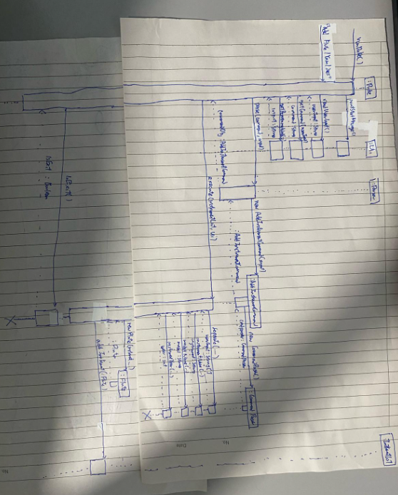

# Developer Guide

## Acknowledgements

{list here sources of all reused/adapted ideas, code, documentation, and third-party libraries -- include links to the original source as well}

## Design & implementation

### Add Instrument feature

#### Implementation

The add instrument mechanism is facilitated by `AddInstrumentCommand`. It extends
`Command` class with execute method, to execute its command. It is initialise by
the `parser` object's parse() method. Then the `AddInstrumentCommand` object will
call execute to add instrument into the `instrumentList`. 

Given below is an example usage scenario and how the add instrument mechanism behaves at each step.

Step 1: The user launches the application for the first time. The user will then be prompted for an input

Step 2: The user will then add an instrument using the `add` command word

Step 3: An `AddInstrumentCommand` object will be created and returned by `parser` object and start to execute

Step 4: The `AddInstrumentCommand` object will then call the `CommandParser` object's `seperate` method to split the user input

Step 5: Depending on the instrument input by the user, the corresponding `Instrument` class will be created and added to the `instrumentList`,
a print of the `instrumentList` will occur last.

#### Sequence Diagram

## Product scope
### Target user profile

{Describe the target user profile}

### Value proposition

{Describe the value proposition: what problem does it solve?}

## User Stories

|Version| As a ... | I want to ... | So that I can ...|
|--------|----------|---------------|------------------|
|v1.0|new user|see usage instructions|refer to them when I forget how to use the application|
|v2.0|user|find a to-do item by name|locate a to-do without having to go through the entire list|

## Non-Functional Requirements

{Give non-functional requirements}

## Glossary

* *glossary item* - Definition

## Instructions for manual testing
Available Commands:
1. help: list all commands
2. list: list all instruments
3. add: adds a new instrument
4. delete: deletes an existing instrument
5. reserve: reserves an available instrument
6. return: returns a reserved instrument
7. exit: quit SirDukeBox

{Give instructions on how to do a manual product testing e.g., how to load sample data to be used for testing}
