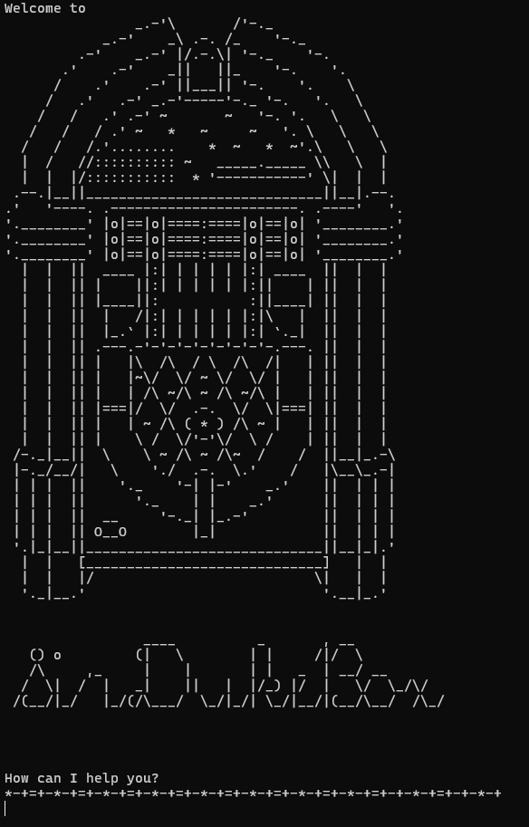

# User Guide

## Introduction

`SirDukeBox` is a **desktop app for managing instrument inventory, reservations, and finances.** 

## Quick Start


1. Ensure that you have Java 17 or above installed.
1. Down the latest version of `SirDukeBox` from [here](http://link.to/duke).
2. Copy the downloaded file to the folder you wish to use as the _home folder_ for `SirDukeBox`
3. Open a command terminal, `cd` into the folder you put the jar file in, and use the `java -jar duke.jar` command to run the application.
4. Upon start up, `SirDukeBox` should reflect the following message in your terminal: 
5. Type commands in the terminal and press Enter to execute. Here are some commands you could try:
   * `help`: Lists all available commands for the user to input
   * `list`: Lists all items currently in the database
   * `exit`: Exits the app
6. Refer to **Features** below for a detailed list of all commands  

## Features

### List out Commands: `help`

Lists all available commands. A brief description for each command is included.

Format: `help`

Example of usage: 

`help`

Expected output: 

```
Available Commands:  
help: list all commands  
list: list all instruments  
add: adds a new instrument  
delete: deletes an existing instrument  
reserve: reserves an available instrument  
extend: changes the return date of a reserved instrument  
return: returns a reserved instrument  
user: choose user commands  
recommend: recommends a recommended instrument  
exit: quit SirDukeBox
```

### Adding an Instrument: `add`

Adds a new instrument to the database. 

Format: `add INSTRUMENT_NAME|INSTRUMENT_MODEL|INSTRUMENT_YEAR`

* `INSTRUMENT_NAME` refers to the type of instrument being added (e.g. "Guitar")
* `INSTRUMENT_MODEL` refers to the brand/model of the specific instrument being added (e.g. "Yamaha")
* `INSTRUMENT_YEAR` refers to the year of production of the instrument being added (e.g. "1989")

Example of usage: 

`add Guitar|Yamaha|1989`

Expected output: 
```
*-+=+-*-+=+-*-+=+-*-+=+-*-+=+-*-+=+-*-+=+-*-+=+-+-*-+=+-+-*-+
Here is the list of instruments:
1. Guitar | Yamaha | 1989 |
*-+=+-*-+=+-*-+=+-*-+=+-*-+=+-*-+=+-*-+=+-*-+=+-+-*-+=+-+-*-+
Would you like to assign this instrument to a user? [Y/N]
```

Adding an instrument allows you to assign it to a `user` 

### Deleting an Instrument: `delete`

Deletes an existing instrument from the database. 

Format: `delete INSTRUMENT_NUMBER`

* `INSTRUMENT_NUMBER` refers to the number assigned to the 
particular instrument. Use `list` to view each instrument's `INSTRUMENT_NUMBER`

Example of usage:

```delete 1```

Expected output:
```
Deleting instrument: Guitar | Yamaha | 1989 |
Now you have 0 instruments
*-+=+-*-+=+-*-+=+-*-+=+-*-+=+-*-+=+-*-+=+-*-+=+-+-*-+=+-+-*-+
Removed instrument [Guitar | Yamaha | 1989 | ] from user [Kash]
*-+=+-*-+=+-*-+=+-*-+=+-*-+=+-*-+=+-*-+=+-*-+=+-+-*-+=+-+-*-+
```

### List Instruments: `list`

Lists instruments stored in the database according to their `INSTRUMENT_NUMBER`

Format: `list`

Example of usage:

`list`

Expected output: 
```
*-+=+-*-+=+-*-+=+-*-+=+-*-+=+-*-+=+-*-+=+-*-+=+-+-*-+=+-+-*-+
Here is the list of instruments:
1. Guitar | Yamaha | 1989 | Rented | Rented from: 1/4/2025 | Rented to: 2/4/2025
2. Piano | Yamaha | 2016 | 
3. Flute | Yamaha | 2023 | 
4. Guitar | Fender | 1962 | 
5. Guitar | Fender | 2020 | 
6. Piano | Bosendorfer | 2023 | Rented
7. Piano | Steinway & Sons | 2020 | 
*-+=+-*-+=+-*-+=+-*-+=+-*-+=+-*-+=+-*-+=+-*-+=+-+-*-+=+-+-*-+
```

### List of Instrument Stocks: `list stock`

Lists the total, rented and available quantity for all instruments in the database according to their INSTRUMENT_NAME

Format: `list stock`

Example of usage:

`list stock`

Expected output:
```
*-+=+-*-+=+-*-+=+-*-+=+-*-+=+-*-+=+-*-+=+-*-+=+-+-*-+=+-+-*-+
Here is the remaining stock of instruments:
|Instrument:  |Total QTY:  |Rented QTY:  |Available QTY:  |
|Guitar       |3           |1            |2               |
|Piano        |3           |1            |2               |
|Flute        |1           |0            |1               |
*-+=+-*-+=+-*-+=+-*-+=+-*-+=+-*-+=+-*-+=+-*-+=+-+-*-+=+-+-*-+
```
### Filtered List of Instruments: `list filter by:`

Lists the relevant instruments according to the `FILTER` and `SEARCH_TERM` provided by the user.

Format: `list filter by: FILTER SEARCH_TERM`

* Possible combinations of `FILTER` and `SEARCH_TERM`
  * `FILTER`: `name`, `SEARCH_TERM`: `INSTRUMENT_NAME`
    * Filters instruments according to the specified `INSTRUMENT_NAME`
  * `FILTER`: `model`, `SEARCH_TERM`: `INSTRUMENT_MODEL`
    * Filters instruments according to the specified `INSTRUMENT_MODEL`
  * `FILTER`: `year`, `SEARCH_TERM`: `INSTRUMENT_YEAR`
    * Filters instruments according to the specified `INSTRUMENT_YEAR`
  * `FILTER`: `reserved` (`SEARCH_TERM` is not required)
    * Filters instruments that `is_rented()`
  * `FILTER`: `available` (`SEARCH_TERM` is not required)
    * Filters instruments that are not `is_rented()`

Example of usage:

`list filter by: model Yamaha`

Expected output:
```
*-+=+-*-+=+-*-+=+-*-+=+-*-+=+-*-+=+-*-+=+-*-+=+-+-*-+=+-+-*-+
Here is the list of instruments:
1. Guitar | Yamaha | 1989 | Rented | Rented from: 1/4/2025 | Rented to: 2/4/2025
2. Piano | Yamaha | 2016 | 
3. Flute | Yamaha | 2023 | 
*-+=+-*-+=+-*-+=+-*-+=+-*-+=+-*-+=+-*-+=+-*-+=+-+-*-+=+-+-*-+
```

### Reserving an Instrument: `reserve`

Reserves an unreserved instrument in the database. 

Format: `reserve INSTRUMENT_NUMBER`

* `INSTRUMENT_NUMBER` refers to the number assigned to the
  particular instrument. Use `list` to view each instrument's `INSTRUMENT_NUMBER`

Example of usage:

`reserve 6`

Expected output: 
```
Reserving instrument: Piano | Bosendorfer | 2023 |
*-+=+-*-+=+-*-+=+-*-+=+-*-+=+-*-+=+-*-+=+-*-+=+-+-*-+=+-+-*-+
Here is the list of instruments:
1. Guitar | Yamaha | 1989 | Rented | Rented from: 1/4/2025 | Rented to: 2/4/2025
2. Piano | Yamaha | 2016 |
3. Flute | Yamaha | 2023 |
4. Guitar | Fender | 1962 |
5. Guitar | Fender | 2020 |
6. Piano | Bosendorfer | 2023 | Rented
7. Piano | Steinway & Sons | 2020 |
*-+=+-*-+=+-*-+=+-*-+=+-*-+=+-*-+=+-*-+=+-*-+=+-+-*-+=+-+-*-+
```

### Reserving an Instrument (with deadline): `reserve`

Reserves an unreserved instrument in the database from a specified `START_DATE` to a specified `END_DATE`.

Format: `reserve INSTRUMENT_NUMBER from: START_DATE to: END_DATE`

* `INSTRUMENT_NUMBER` refers to the number assigned to the
  particular instrument. Use `list` to view each instrument's `INSTRUMENT_NUMBER`
* `START_DATE` refers to the date at which the reservation commences
* `END_DATE` refers to the date at which the reservation ends
* Both `START_DATE` and `END_DATE` are in the format: `(dd/mm/yyyy)`

Example of usage:

`reserve 5 from: 01/04/2025 to: 02/04/2025`

Expected output:
```
*-+=+-*-+=+-*-+=+-*-+=+-*-+=+-*-+=+-*-+=+-*-+=+-+-*-+=+-+-*-+
Here is the list of instruments:
1. Guitar | Yamaha | 1989 | Rented | Rented from: 1/4/2025 | Rented to: 2/4/2025
2. Piano | Yamaha | 2016 | 
3. Flute | Yamaha | 2023 | 
4. Guitar | Fender | 1962 | 
5. Guitar | Fender | 2020 | Rented | Rented from: 1/4/2025 | Rented to: 2/4/2025
6. Piano | Bosendorfer | 2023 | Rented
7. Piano | Steinway & Sons | 2020 | 
*-+=+-*-+=+-*-+=+-*-+=+-*-+=+-*-+=+-*-+=+-*-+=+-+-*-+=+-+-*-+
```

### Extending a Reservation: `extend`

Extends the reservation period of a reserved instrument

Format: `extend INSTRUMENT_NUMBER to: END_DATE`

* `INSTRUMENT_NUMBER` refers to the number assigned to the
  particular instrument. Use `list` to view each instrument's `INSTRUMENT_NUMBER`
* `END_DATE` refers to the date at which the reservation ends
* `END_DATE` is in the format: `(dd/mm/yyyy)`

Example of usage:

`extend 5 to: 04/04/2025`

Expected output: 
```
Extending reservation of instrument: Guitar from 2025-04-01 to 2025-04-04
*-+=+-*-+=+-*-+=+-*-+=+-*-+=+-*-+=+-*-+=+-*-+=+-+-*-+=+-+-*-+
Here is the list of instruments:
1. Guitar | Yamaha | 1989 | Rented | Rented from: 1/4/2025 | Rented to: 2/4/2025
2. Piano | Yamaha | 2016 | 
3. Flute | Yamaha | 2023 | 
4. Guitar | Fender | 1962 | 
5. Guitar | Fender | 2020 | Rented | Rented from: 1/4/2025 | Rented to: 4/4/2025
6. Piano | Bosendorfer | 2023 | Rented
7. Piano | Steinway & Sons | 2020 | 
*-+=+-*-+=+-*-+=+-*-+=+-*-+=+-*-+=+-*-+=+-*-+=+-+-*-+=+-+-*-+
```

### Returning an Instrument: `return`

Returns a reserved instrument

Format: `return INSTRUMENT_NUMBER`

* `INSTRUMENT_NUMBER` refers to the number assigned to the
  particular instrument. Use `list` to view each instrument's `INSTRUMENT_NUMBER`

Example of usage:

`return 5`

Expected output: 
```
Returning instrument: Guitar | Fender | 2020 | Rented | Rented from: 1/4/2025 | Rented to: 4/4/2025
*-+=+-*-+=+-*-+=+-*-+=+-*-+=+-*-+=+-*-+=+-*-+=+-+-*-+=+-+-*-+
Here is the list of instruments:
1. Guitar | Yamaha | 1989 | Rented | Rented from: 1/4/2025 | Rented to: 2/4/2025
2. Piano | Yamaha | 2016 | 
3. Flute | Yamaha | 2023 | 
4. Guitar | Fender | 1962 | 
5. Guitar | Fender | 2020 | 
6. Piano | Bosendorfer | 2023 | Rented
7. Piano | Steinway & Sons | 2020 | 
*-+=+-*-+=+-*-+=+-*-+=+-*-+=+-*-+=+-*-+=+-*-+=+-+-*-+=+-+-*-+
```

### User commands

User will bring up a list of commands that pertains to users:
1. Adding a user
2. Removing a user
3. Listing all users
4. Listing a user's instruments
   ...which is selected by inputting the index of the command and following onscreen instructions

Example of usage:
Input:
```
user
```
Expected output: 
```
1. Add User
2. Remove User
3. Print list of users
4. Print list of instruments of specific user
```
Input:
```
4
```
Expected output:
```
Please select from the following existing users:
1. Teng Wai
2. Om
3. Kashfy
4. Jason
```
Input:
```
1
```
Expected output:
```
Available List Choices:
1. Rental History
2. Current Instruments
```
Input:
```
1
```
Expected output:
```
List is empty, let's add some instruments :)
```


### Recommendation for an instrument: `recommend`

Recommends an instrument from existing instrument list/inventory that is popular and not rented

Format: `recommend INSTRUMENT_NAME`

* The `INSTRUMENT_NAME` can only be "Guitar", "Piano" or "Flute"

Example of usage:

`recommend Guitar`

Expected output:
```
*-+=+-*-+=+-*-+=+-*-+=+-*-+=+-*-+=+-*-+=+-*-+=+-+-*-+=+-+-*-+
Here is our recommendation: 
5. Guitar | Fender | 2020 | 
*-+=+-*-+=+-*-+=+-*-+=+-*-+=+-*-+=+-*-+=+-*-+=+-+-*-+=+-+-*-+
*-+=+-*-+=+-*-+=+-*-+=+-*-+=+-*-+=+-*-+=+-*-+=+-+-*-+=+-+-*-+
```

### Exiting the Program: `exit`

Exits the program

Format: `exit`

### Saving the data
SirDukeBox data are saved automatically as .txt files in the same directory as the duke.jar file.  
The files are saved as `SirDukeBox.txt` and `DukeFinance.txt`
> NOTE: Any changes made to the .txt files outside of the 
> functionalities of SirDukeBox (e.g. editing the .txt file manually in notepad)
> may render its format invalid. This may result in `SirDukeBox` being unable
> to load an existing .txt file 

