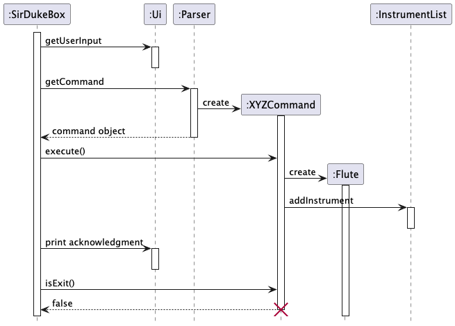
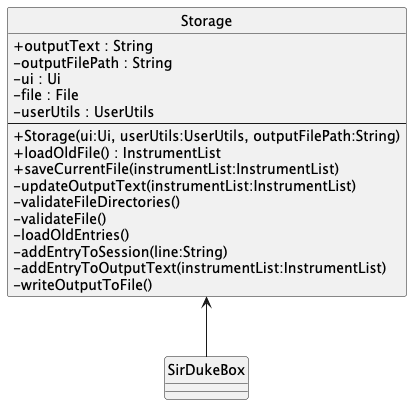
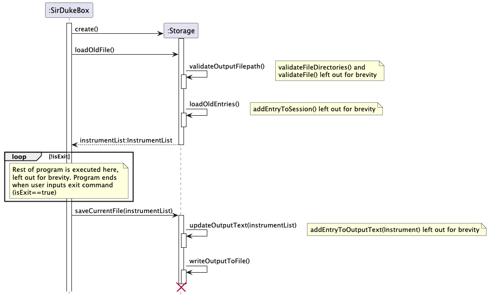
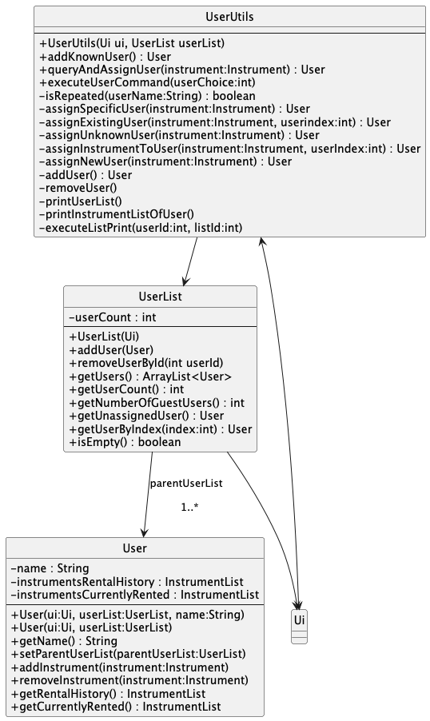

# Teng Wai - Project Portfolio Page

## Overview

Manage instrument rentals faster than a typical mouse/GUI driven app! Keep track of stock, user rental history, and
instrument-related finances in an all-in-one tracking app.

### Summary of Contributions

[**Code Contributed
**](https://nus-cs2113-ay2425s2.github.io/tp-dashboard/?search=&sort=groupTitle&sortWithin=title&timeframe=commit&mergegroup=&groupSelect=groupByRepos&breakdown=true&checkedFileTypes=docs~functional-code~test-code~other&since=2025-02-21&tabOpen=true&tabType=authorship&tabAuthor=adoorknob&tabRepo=AY2425S2-CS2113-W11-1/tp%5Bmaster%5D&authorshipIsMergeGroup=false&authorshipFileTypes=docs~functional-code~test-code~other&authorshipIsBinaryFileTypeChecked=false&authorshipIsIgnoredFilesChecked=false)

**Enhancements Implemented**

* **Feature:** Added `User` functionality
    * `UserUtils`, `User` and `UserList`
* **Feature:** `Storage` for saving data
* **Enhancements:** `Ui` for main functionality
* **Testing:** for relevant classes and methods
    * `User`, `UserList` and `UserUtils`
    * `Storage`, `FinanceStorage`

**Contributions to UserGuide**

* Explanation of `User` commands and feature

**Contributions to DeveloperGuide**

* Architecture diagram
* Example `Command` sequence diagram
* Design and Implementation

**Contributions to team-based tasks**

* Setting up the Github team org and repo
* Setting up tools (Github, Gradle)
* Updating developer docs
    * Overall architecture
    * Appendix: Requirements
    * Appendix: Instructions for Manual Testing

**Review/mentoring contributions**

* Reviewed/made (informed) edits to UML diagrams

**Contributions beyond the project team**

## Appendix

### Contributions to the Developer Guide

As much of the Developer Guide was written by me, I have opted to leave only the diagrams I have contributed in here.

**System Architecture Example Sequence Diagram**

**Command Component**

**Storage Component**

Class Diagram:

Sequence Diagram:

**User**

Class Diagram:

Sequence Diagram:

### Contributions to the User Guide